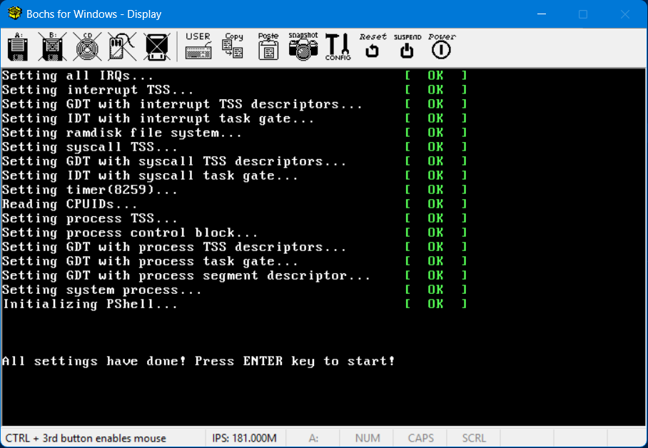

PiscisOS  https://tishion.github.io/PiscisOS
=====
a tiny multi-task operating system based x86 architecture, run in protect mode




Build in one step and Run
=======

if you want to build in one step just run:
 
> build.bat

and also you can add parameter -run to launch it with bochs (you need to install bochs first)

> build.bat -run

enjoy this tiny OS


Build components
========
if you want to build some components s, you can do as follows

1.  install Flat assembler, add the environment path

2.  build the boot sector
> cd src\boot
>
> fasm bootsect.asm

  you will get X:\xxxxx\PiscisOS\out\bootsect.bin

3. build kernel
> cd src\
>
> fasm pkernel.asm
    
  then you will get X:\xxxxx\PiscisOS\out\pkernel.bin
  
4. build shell
> cd X:\xxxxx\PiscisOS\src\shell
>
> fasm shell.asm
  
  then you will get X:\xxxxx\PiscisOS\out\shell.bin
  
4. make image file.....


# File List

```
PISCISOS
│  build.bat          - build script for Windows
│  build.sh           - build script for Linux
│  setupenv.bat       - setup development environment on Windows
│  setupenv.sh        - setup development environment on Linux
│
├─docs                - documents
|
├─src                 - source root folder
│  ├─apps             - application source folder
│  │  ├─date
│  │  ├─debug
│  │  ├─echo
│  │  ├─hello
│  │  ├─include
│  │  ├─ls
│  │  └─time
│  ├─boot             - boot sector source 
│  ├─kernel           - kernel source
│  │  ├─drivers       - kernel drivers
│  │  └─include       - kernel include 
│  │      └─drivers
│  └─shell            - shell application source
│      └─include
└─tools               - tools building & burning image
    └─mtools          - burning image tools on Windows

```
